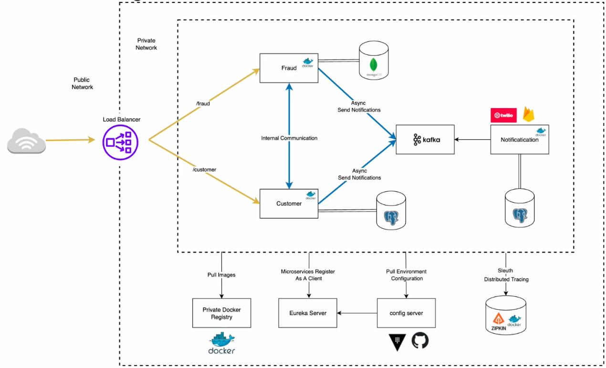

# Springboot Microservice 3



This project is a microservices-based system developed using 
Spring Boot, designed to manage customer registration processes 
with fraud detection and notification after successful registration. 
The system consists of three main services: Customer Service, 
Fraud Service, and Notification Service. Customer Service is 
responsible for handling customer registration, receiving 
registration data from users, performing initial validation, 
and sending the data to Fraud Service for fraud detection. 
Fraud Service processes the data to detect potential fraud 
and returns the results to Customer Service. Upon receiving 
confirmation from Fraud Service that there is no fraud, 
Customer Service sends a message to Notification Service via 
RabbitMQ to notify users about their registration status. 
Communication between Customer Service and Fraud Service is 
synchronous, while communication between Customer Service 
and Notification Service is asynchronous using RabbitMQ. 
This system combines the use of Spring Boot for microservices 
development and RabbitMQ for asynchronous communication, 
ensuring an efficient and secure registration process.

## Table of Contents

1. [Features](#features)
2. [Requirements](#requirements)
3. [Installation](#installation)
4. [Endpoints](#endpoints)
5. [Contact](#contact)
6. [Credits](#credits)

## Features

- **Customer Service**
    - Register Customer

- **Fraud Service**
    - Fraud check for customer registration

- **Notification Service**
    - Send simple log notifications if order placed successfully

- **API Gateway**
    - Main entry point for all services
    - Route requests

- **Eureka Server**
    - Enable services to discover and communicate with each other
    - Implemented with **Eureka Server**

- **RabbitMQ**
    - Asynchronous communication between services
    - Streaming platform for real-time data pipelines

- **PostgreSQL**
    - Store unstructured data in JSON document format

- **Docker**
    - Run the application in containers
    - Ensure consistency between development and production environments

- **Zipkin**
    - Distributed tracing system
    - Collect execution time data (traces)
    - Help troubleshoot latency issues

## Requirements
- Java 17
- Spring Boot 2.5.7
- Spring Cloud 2020.0.3
- Maven 3.9.6
- Docker

## Installation

**A. Installation local**
1. Clone repository:
    ```bash
    git clone git@github.com:anom768/springboot-microservices-3.git
    ```
2. Build the project using Maven:
    ```bash
    mvn clean install
    ```
3. Run Zipkin on docker:
    ```bash
    docker run -d -p 9411:9411 openzipkin/zipkin
    ```
4. Run Eureka-Server:
    ```bash
    cd eureka-server
    ```
    ```bash
    mvn spring-boot:run
    ```
5. Run Api-Gateway:
    ```bash
    cd api-gateway
    ```
    ```bash
    mvn spring-boot:run
    ```
6. Run Customer-Service:
    ```bash
    cd customer-service
    ```
    ```bash
    mvn spring-boot:run
    ```
7. Run Fraud-Service:
    ```bash
    cd fraud-service
    ```
    ```bash
    mvn spring-boot:run
    ```
8. Run Notification-Service:
    ```bash
    cd notification-service
    ```
    ```bash
    mvn spring-boot:run
    ```
**B. Installation Docker**
1. Run on docker
    ```bash
    docker compose up -d
    ```

## Endpoints

1. Customer Service
    - POST http://localhost:8080/api/v1/customer - Register new customer
        - example body request
            ```json
              {
                  "fisrtName": "Bangkit",
                  "lastName": "Anom",
                  "email": "bangkit@gmail.com"
              }
          ```
2. Eureka-Server
    - Run on browser - http://localhost:8080/eureka/web
3. Zipkin
    - Run on browser - http://localhost:9411
4. PgAdmin
    - Run on browser - http://localhost:5050

## Contact
- Email     : bangkitunom87@gmail.com
- Linkedin  : https://www.linkedin.com/in/bangkit-sedhayu
- Github    : https://github.com/anom768

## Credits
This application is based on the teachings and materials from
the Amigoscode. The course provided valuable
insights and knowledge essential for developing this project.
https://www.amigoscode.com/